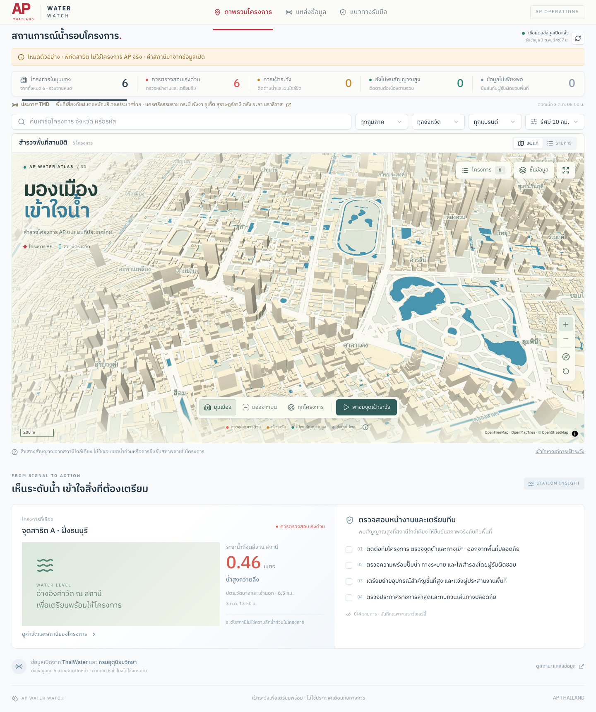

# AP Water Watch

**เห็นสัญญาณน้ำ เข้าใจพื้นที่ เตรียมพร้อมให้แต่ละโครงการ**

[](https://github.com/SuphakornP/ap-water-watch/actions/workflows/ci.yml)
[](LICENSE)

เครื่องมือเฝ้าระวังน้ำและฝนสำหรับสถานที่หลายแห่ง แสดงเมืองสามมิติและสถานีบนพิกัดจริง ใช้ข้อมูลเปิดจาก ThaiWater และกรมอุตุนิยมวิทยา เพื่อช่วยจัดลำดับพื้นที่ที่ควรตรวจสอบ พร้อมรายการเตรียมความพร้อม

> **Public source edition:** repository นี้มีพิกัดสาธิต 6 จุด ซึ่งไม่ใช่โครงการ AP จริง ส่วนค่าตรวจวัดมาจากแหล่งข้อมูลจริงเมื่อเชื่อมต่อได้ ข้อมูลโครงการ AP ภายในและฟอนต์ AP ไม่รวมอยู่ใน repository นี้



## สิ่งที่ทำได้

- **สำรวจเมือง 3D:** MapLibre + Three.js, อาคาร/แม่น้ำจาก OpenStreetMap, หมุดสถานที่และสถานีตรวจวัด
- **สำรวจขอบเขต 77 จังหวัด:** เปิดชั้นข้อมูลขอบเขตจังหวัดแล้วเลือกจังหวัดเพื่อจัดกรอบแผนที่และกรองทะเบียนสถานที่ ข้อมูลจาก [thailand_gis / HDX](docs/THAILAND-GIS-NOTICE.md) อ้างอิงปี 2565 ไม่ใช่ขอบเขตน้ำท่วม
- **แยกสถานการณ์กับการเลือก:** สีแดง/อำพัน/เขียว/เทาคงระดับคัดกรอง ส่วนเส้นสีน้ำเงินบอกจุดที่เลือก ข้อมูลเก่าและข้อมูลไม่ครบไม่แสดงเป็นปกติ
- **คัดกรองพื้นที่:** ค้นหา กรองภูมิภาค จังหวัด แบรนด์ ระดับเฝ้าระวัง และรัศมีสถานี 5/10/20 กม. โดยเริ่มต้นที่ 5 กม.
- **เข้าใจเหตุผล:** ดูสถานีที่ให้สัญญาณ ค่าวัด เวลาวัด และระยะห่าง พร้อมแสดงสถานที่กับสถานีในมุมเดียวกัน
- **อ่านค่าวัดเทียบเกณฑ์:** เลือกสถานีน้ำเพื่อดูระดับเทียบตลิ่ง หรือสถานีฝนเพื่อสลับค่าฝนสะสม 1/24 ชั่วโมงพร้อมเส้นเกณฑ์คัดกรอง
- **ดูภาพระดับน้ำ 3D:** เปิดภาพตัดขวางเชิงอธิบายจากกราฟสถานีได้เมื่อมีระดับตลิ่งอ้างอิง ภาพไม่ใช่ภูมิประเทศจริงหรือความลึกน้ำท่วมสถานที่
- **เห็นพื้นที่ที่ควรตรวจสอบก่อน:** รายการข้างแผนที่แสดงเหตุผลและเวลาวัด กดไปยังแผนที่หรือรายการเตรียมพร้อมได้ทันที
- **จัดลำดับงาน:** พาชมพื้นที่เฝ้าระวัง ดูสถานที่ที่ใช้สถานีต้นเหตุเดียวกัน และเปิด checklist ตามสถานการณ์
- **ใช้งานหลายหน้าจอ:** มุมเมือง/มองจากบน, เต็มจอ, เปิด–ปิดชั้นข้อมูล, ลด animation, รายการที่ใช้คีย์บอร์ดได้
- **รับมือข้อมูลไม่ครบ:** แยกค่าหาย ข้อมูลเก่า และต้นทางล่มออกจากสถานะปกติ

## มุมมองผู้บริหารและการส่งต่อ

หน้าแรกเปิดแผนที่ 2D พร้อมการจัดกลุ่มสถานที่ ส่วนมุมมองผู้บริหารเรียงตาม **สถานที่ → ระดับคัดกรอง → เหตุผล → ผลกระทบที่ต้องตรวจ → สิ่งที่ควรทำ** โดยแยกข้อมูลวัดจริง การประเมินของระบบ และข้อมูลพยากรณ์ที่ยังไม่มี เปิดแท็บผู้บริหารหรือใช้ `?view=executive` และเปิดรายการด้วย `?view=list` ได้ รวมถึงดูภาพรวมรายจังหวัด หลักฐาน และ checklist ของแต่ละสถานที่ ขอบเขตจังหวัดและเส้นอ้างอิงสถานีไม่ใช่ Risk Zone น้ำท่วมหรือเส้นทางน้ำที่ยืนยันแล้ว

คัดลอกลิงก์พร้อมตัวกรองและสถานที่ที่เลือก หรือส่งออก Snapshot เป็น PNG, SVG และพิมพ์ / PDF ได้ ภาพสรุปแสดงไม่เกิน 5 สถานที่แรกตามลำดับที่ควรตรวจสอบ พร้อมจำนวนตามตัวกรอง เวลาวัด เวลาดึงข้อมูล และข้อจำกัด ลิงก์เปิดข้อมูลล่าสุดตามสิทธิ์ของผู้รับ ส่วนภาพและ PDF เก็บสถานการณ์ขณะส่งออก ฉบับ public แสดงป้ายข้อมูลสาธิตบน Dashboard และ Snapshot เสมอเมื่อ `data/release.json` มี `demo: true`

ระบบยังไม่มีข้อมูลฝนสะสม 48 ชั่วโมง แบบจำลองผลกระทบรายสถานที่ 48 ชั่วโมง / 7 วัน การยืนยันพื้นที่น้ำท่วมซ้อนทับกับขอบเขตสถานที่ หรือเวลาน้ำถึงพื้นที่ ใช้ช่วงเวลาเหล่านี้วางแผนติดตามร่วมกับพยากรณ์ทางการ ห้ามตีความสีเขียวว่าได้รับรองความปลอดภัย หรือใช้สัญญาณใกล้เคียงยืนยันว่าน้ำท่วมสถานที่แล้ว

**Infographic รายโครงการ** เปิดภาพตัวอย่างของสถานที่ที่เลือกโดยตรง รวมถึงสถานที่นอก 5 ลำดับแรกของภาพรวม แสดงสถานะคัดกรอง ระดับน้ำเทียบตลิ่งหรือค่า MSL ที่ระบุชัด ค่าฝน 1/24 ชั่วโมงจากสถานีที่เลือกแยกกัน เวลาวัด และสิ่งที่ทีมควรทำ 3 ข้อ ข้อมูลในภาพคงเดิมระหว่างตรวจทานและ PNG ตรงกับภาพตัวอย่าง เลือก **ภาพรวม** เพื่อดูจำนวนตามตัวกรองและ 5 ลำดับแรก หรือสร้างภาพใหม่จากข้อมูลล่าสุดในหน้า ระบบตรวจความเก่าของค่าวัดอีกครั้งเมื่อสร้างภาพ พร้อมส่งออก SVG และพิมพ์ / PDF ได้

แผนที่เริ่มต้นด้วย **แสดงเป็นกลุ่ม** ตัวเลขในวงกลมคือจำนวนสถานที่ สีใช้สัญญาณที่ควรตรวจสอบก่อน โดยข้อมูลไม่เพียงพออยู่ก่อนสถานะปกติ กดวงกลมเพื่อซูมและเปิดรายชื่อสมาชิก กลุ่มเปลี่ยนตามการซูมและตัวกรอง เป็นเพียงการรวมจุดตามระยะ ไม่ใช่พื้นที่รับน้ำหรือขอบเขตน้ำท่วม สถานที่ที่มีพิกัดซ้อนกันยังเลือกได้ทีละรายการ ปิดการจัดกลุ่มเพื่อดูหมุดรายสถานที่ และวงเลือกสีน้ำเงินแยกจากสีความเสี่ยงเสมอ

แผนที่เปิดชั้น **พื้นที่น้ำท่วมในรอบ 7 วัน (GISTDA)** ไว้ตั้งแต่เริ่ม เพื่อดูภาพพื้นที่ตรวจพบน้ำท่วมจากบริการเดียวกับ ThaiWater สามารถปิดชั้นภาพ ปรับความทึบ และดูสถานะโหลดหรือข้อผิดพลาดได้ ภาพเป็นข้อมูลย้อนหลังตามชั้นข้อมูลของต้นทาง ไม่ใช่พยากรณ์ ความลึกน้ำ หรือการยืนยันว่าน้ำท่วมสถานที่ขณะนี้ ต้นทางไม่ส่งวันที่สำรวจและอาจเก็บภาพในแคช 24 ชั่วโมง เวลาโหลดจึงไม่ยืนยันความสดของภาพ พื้นที่ไม่มีสีไม่ยืนยันความปลอดภัย และชั้นภาพไม่เปลี่ยนระดับคัดกรองหรือผลใน Snapshot อ่าน [ที่มา การรับภาพ และข้อจำกัด GISTDA](docs/gistda-source.md)

หมุดและภาพ GISTDA เริ่มโหลดเมื่อรูปแบบแผนที่พร้อม โดยไม่ต้องรอภาพพื้นหลังทั้งหมด Three.js และสัญลักษณ์น้ำโหลดเมื่อเลือก 3D และคืนทรัพยากรเมื่อกลับ 2D กราฟสถานีโหลดเมื่อเปิดรายละเอียดหรือมาตรวัด ลิงก์ผู้บริหารและรายการไม่เปิดแผนที่เบื้องหลัง และการเลือกสถานที่ไม่ส่งชุดพิกัดสถานีใหม่ทุกครั้ง ระบบยังคงแคชภาพและรวมคำขอซ้ำตามขอบเขตเดิม เมื่อปิด GISTDA จะลบชั้นภาพและหยุดคำขอใหม่

## เริ่มใช้งาน

ต้องมี **Node.js 24 LTS**, npm และอินเทอร์เน็ตสำหรับแผนที่/ข้อมูลเปิด ไม่ต้องใช้ API key หรือฐานข้อมูลสำหรับฟังก์ชันปัจจุบัน

```sh
git clone https://github.com/SuphakornP/ap-water-watch.git
cd ap-water-watch
npm ci
npm run dev
```

เปิด <http://127.0.0.1:5173> หากใช้ nvm สามารถรัน `nvm use` ตาม `.nvmrc` ได้

```sh
npm test
npm run typecheck
npm run build
npm start
```

`npm start` เปิด build ผ่าน Wrangler ในเครื่อง ดู URL ที่ terminal แสดง ส่วน `npm run build` เพียงสร้างไฟล์ ไม่เผยแพร่เว็บ

## ใช้ข้อมูลสถานที่ของคุณ

อ่าน [รูปแบบข้อมูลและวิธีนำเข้า](docs/DATA.md) วาง CSV ที่ได้รับอนุญาตไว้ใน `data/local/` ซึ่งถูก gitignore แล้ว

```sh
python3 scripts/prepare-projects.py --source data/local/projects.csv --output-dir data
```

หลังตรวจผลนำเข้า ให้ตั้ง `demo` เป็น `false` ใน `data/release.json` สำหรับการใช้งานส่วนตัว และรันใหม่ เก็บข้อมูลจริงใน private repository หรือระบบของคุณ; public branch นี้ตั้งใจใช้ข้อมูลสาธิตเท่านั้น

## ข้อมูลและเกณฑ์ประเมิน

ข้อมูลน้ำ/ฝนดึงผ่าน `/api/monitor` แยกแต่ละแหล่งด้วย timeout และ cache 5 นาที เบราว์เซอร์อัปเดตทุก 5 นาทีขณะเปิดหน้า และตรวจความเก่าของค่าวัดทุกนาที

| สถานะ | สัญญาณที่ใช้ |
| --- | --- |
| ควรตรวจสอบเร่งด่วน | น้ำ status 5 และยืนยันระดับน้ำสูงกว่าตลิ่ง ≥0.10 ม.; ฝน ≥90.1 มม./24 ชม. หรือ ≥50.1 มม./1 ชม. |
| ควรเฝ้าระวัง | น้ำ status 4 หรือ status 5 ที่ยังไม่ถึง 0.10 ม. / ยังยืนยันส่วนต่างไม่ได้; ฝน ≥35.1 มม./24 ชม. หรือ ≥25.1 มม./1 ชม. |
| ยังไม่พบสัญญาณสูง | มีค่าน้ำและฝน 1/24 ชม. ที่ใช้ได้ครบ และไม่เข้าเกณฑ์ด้านบน |
| ข้อมูลไม่เพียงพอ | ข้อมูลไม่ครบ เก่า หรือไม่มีสถานีในระยะ โดยไม่มีสัญญาณสูงอื่นที่ใช้ได้ |

ใช้สัญญาณรุนแรงที่สุดจากทุกสถานีในรัศมี ไม่ได้ใช้เพียงสถานีที่ใกล้ที่สุด ค่าที่เกิน 6 ชั่วโมง ไม่มีเวลา หรือเวลาอยู่ในอนาคตเกิน 15 นาทีไม่ใช้จัดระดับ น้ำ status 1/2 หมายถึงน้ำน้อย ไม่ใช่ระดับเตือนน้ำท่วม เกณฑ์ล้นตลิ่ง 0.10 ม. ใช้ผลต่างระดับน้ำกับระดับตลิ่งจริงก่อนปัดเศษแสดงผล หากไม่มีระดับตลิ่งหรือข้อมูลขัดแย้ง ยังจัดเป็นเฝ้าระวังและระบุว่าต้องยืนยันส่วนต่าง ไม่ถือว่าปลอดภัย

**สถานีใกล้เคียงไม่ใช่หลักฐานว่าน้ำท่วมสถานที่นั้น** เส้นเชื่อมแสดงการอ้างอิงตามระยะ ไม่ใช่ทางไหลน้ำ ความสูงหลอด 3D สื่อหมวดสถานะ ไม่ใช่ความลึกน้ำท่วม อาคาร OSM ที่ไม่มีความสูงใช้ 8 เมตรเป็นภาพประกอบ

Checklist บันทึกเฉพาะเบราว์เซอร์นั้น ยังไม่มี shared completion, LINE/email/push, ระบบแจ้งเตือนเบื้องหลัง, ประวัติอนุกรมเวลา หรือโมเดลพยากรณ์น้ำท่วม

กราฟระดับน้ำใช้ตลิ่งของสถานีเป็นศูนย์ และแสดงค่าน้ำ/ตลิ่งหน่วย ม.รทก. แยกไว้เพื่ออ้างอิง ขอบล่างของกราฟเป็นช่วงสเกล ไม่ใช่พื้นคลอง ส่วนกราฟฝนเป็นค่าล่าสุดของช่วงสะสมที่เลือก ไม่ใช่กราฟย้อนหลัง

เพิ่มข้อมูลตรงจาก [กรมทรัพยากรน้ำ · Early Warning](https://ews.dwr.go.th/ews/index.php) ในหน้าสำรวจสถานีทั่วประเทศ หลักฐานใกล้สถานที่ ชั้นแผนที่ และภาพสรุป โดยแยกฝน 15 นาที / 12 ชั่วโมง / รายวัน ณ 07:00 ระดับน้ำที่ยังไม่ยืนยันจุดอ้างอิง และสถานะเตือนของ DWR ออกจากเกณฑ์คัดกรองเดิม จับคู่หน่วยงาน รหัสสถานี และพิกัดเพื่อแสดงที่มาที่เกี่ยวข้องกับ ThaiWater โดยไม่นับเป็นหลักฐานอิสระซ้ำหรือเปลี่ยนสีสถานที่อัตโนมัติ

เวลารายงานเตือน เวลาตรวจวัด และเวลารับข้อมูลแยกจากกัน ข้อมูลเก่าหรือไม่มีสถานีในระยะไม่ใช่การยืนยันความปลอดภัย อ่าน [ผลตรวจสอบความครอบคลุม ข้อมูลซ้ำ และข้อจำกัด DWR](docs/dwr-source.md) สำหรับรายละเอียดและจำนวนสถานี ณ วันที่ตรวจสอบ

## โครงสร้าง

```text
app/api/monitor/       ดึงและ normalize ข้อมูลเปิด
components/           Dashboard, แผนที่ 3D, รายการ และ checklist
lib/assessment.ts     เกณฑ์คัดกรอง ระยะทาง และความเก่าข้อมูล
lib/normalize.ts      ตรวจข้อมูล upstream และประกาศ CAP
lib/water-beacons.ts  Three.js layer บนพิกัดแผนที่
lib/city-style.ts     รูปแบบเมืองจาก vector tiles
data/                 พิกัดสาธิตและ metadata
scripts/              ตัวนำเข้า CSV และเครื่องมือ build
public/vendor/        MapLibre worker พร้อม license ต้นฉบับ
tests/                16 tests ของข้อมูล เกณฑ์ และการแสดงหลักฐาน
```

รายละเอียดเพิ่มเติม: [Architecture](docs/ARCHITECTURE.md) · [Data](docs/DATA.md) · [Contributing](CONTRIBUTING.md) · [Security](SECURITY.md)

## แหล่งข้อมูลและเครดิต

- [ThaiWater](https://www.thaiwater.net/) — สถานีน้ำและฝน
- [กรมอุตุนิยมวิทยา](https://www5.tmd.go.th/service/rss) — ประกาศ CAP; [คลังข้อมูลเปิด](https://data.tmd.go.th/dataset/index.php)
- [OpenFreeMap](https://openfreemap.org/quick_start/), [OpenMapTiles](https://openmaptiles.org/), [OpenStreetMap](https://www.openstreetmap.org/copyright) — แผนที่และอาคาร
- [Flood Pop 3D](https://flood.pop.in.th/3d/) / [เมืองน้ำมีชีวิต](https://flood.pop.in.th/water-city/) — แรงบันดาลใจด้านการสำรวจเมืองและอธิบายสถานการณ์ ใช้ implementation ของ repository นี้เอง
- [IBM Plex Sans Thai](https://github.com/IBM/plex/tree/master/packages/plex-sans-thai) — ฟอนต์ฉบับ public ภายใต้ SIL OFL 1.1

## License และการเผยแพร่

โค้ดที่เขียนสำหรับโครงการนี้เผยแพร่ภายใต้ [MIT License](LICENSE) โดยคง license ของส่วนประกอบภายนอกไว้ อ่าน [THIRD_PARTY_NOTICES.md](THIRD_PARTY_NOTICES.md) สำหรับฟอนต์ แผนที่ ข้อมูล และเครื่องหมายการค้า MIT ไม่ได้เปลี่ยนสิทธิ์ของข้อมูลหรือทรัพย์สินภายนอก

Repository นี้เป็น source สาธารณะ ส่วน [AP Water Watch ที่โฮสต์อยู่](https://ap-water-watch.suphakorn-pal.chatgpt.site/) มีการควบคุมสิทธิ์แยกต่างหาก การเปิด repo ไม่ได้เปิดสิทธิ์เข้าใช้งาน Site

`.openai/hosting.json` ใน repo ไม่มี Site ID หรือ database binding หากใช้ Sites ให้สร้าง/เชื่อม Site ของคุณเอง หากนำไปโฮสต์ที่อื่นให้จัดการ authentication, สิทธิ์ข้อมูล และการตั้งค่า runtime ตามสภาพแวดล้อมนั้น

## Nearby cameras

Select a project, then **กล้องใกล้โครงการ**. Search 5/10/20 km independently of water-station screening; camera selection is blue and never changes risk colours. Current sources are source-link only: 511 reviewed BMA road-camera coordinates, 10 RID canal/pumping-station points, and the official ThaiWater camera catalogue (100 supported records at verification). No source currently has verified image redistribution permission, so the application does not fetch or embed camera pictures.

Capture time, image retrieval time and catalogue check time are separate. Unavailable data is not a safety signal. See [verified sources, coverage, rights, caching and QA boundaries](docs/camera-sources.md). Run `npm test` for all flood and camera tests.
