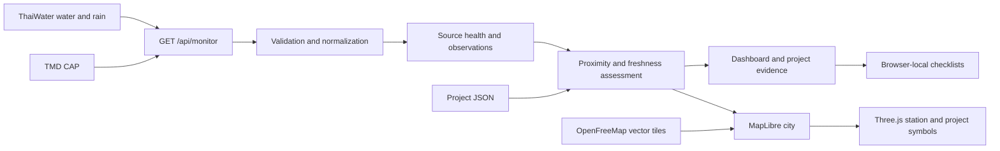

# Architecture

## Runtime

React 19 / TypeScript run on Vinext + Vite with a Cloudflare Worker API. `npm run dev` uses the portable local profile. `npm run build` produces `dist/client` and `dist/server`; `npm start` serves that build with Wrangler locally. No database is used by the monitoring features. The bundled Sites scaffolding is retained for compatibility, but the public configuration is unbound and does not deploy to the maintainer's private Site.

`app/api/monitor/route.ts` fetches upstream services independently with an 18-second timeout, coalesces concurrent requests, and caches normalized responses for five minutes per Worker instance. It is not a durable or globally shared cache.

`lib/normalize.ts` rejects invalid/sentinel values, deduplicates stable station IDs, normalizes Bangkok observation timestamps and validates CAP XML and linked URLs. `lib/assessment.ts` applies freshness, geodesic distance and the strongest qualifying signal within the selected radius.

## Geographic rendering

MapLibre renders the OSM vector map and building extrusions. Three.js shares its WebGL context to place geographic project beacons and qualitative station gauges. Rich symbols are viewport-culled and capped at 250; ordinary map points retain the full inventory. No 3D building assets are copied from the reference website.

MapLibre worker modules are served as static assets so the development framework does not inject window-only code into a worker. `scripts/prepare-map-worker.mjs` regenerates them and the BSD notice from the installed dependency before dev/build.

## Interaction and state

Filters apply to project assessments. The tour selects up to eight spatially distinct elevated-signal areas and stops during manual inspection or before opening a checklist. Co-located water/rain stations offer an explicit choice. A station can list all currently filtered projects that use it as their triggering source.

Checklists are keyed by project and risk tier in localStorage. They are neither shared team records nor certifications of readiness. No external alert delivery, background scheduler, historical database or flood forecast is implemented.

The optional read-only WebMCP project query is registered only when the browser exposes `document.modelContext`; normal UI behavior does not depend on it.
